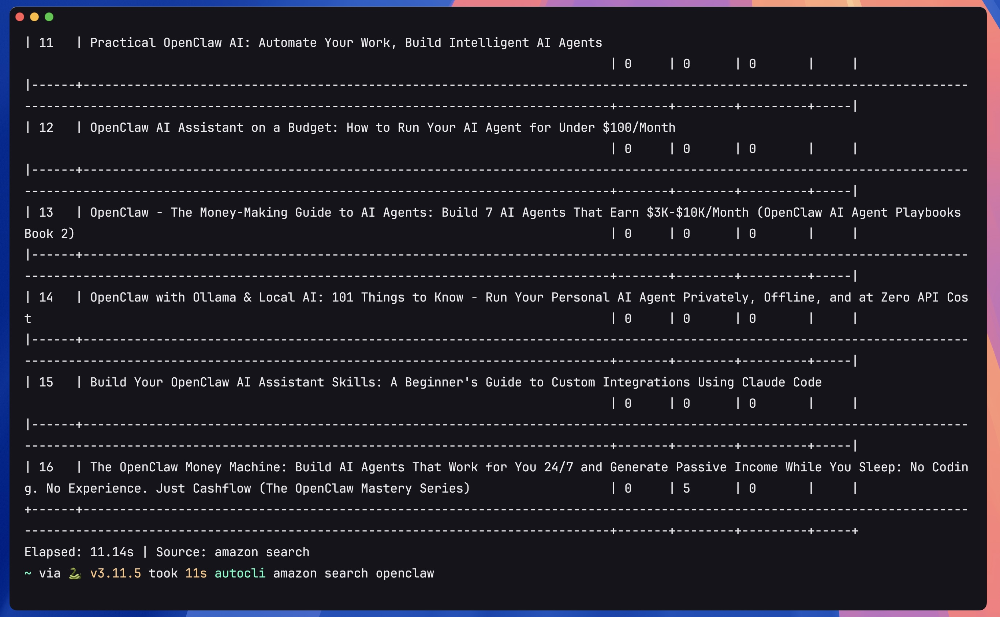

# Ferrss
> Formerly known as **opencli-rs**, then **AutoCLI**. Renamed to **Ferrss** starting from v0.3.11.

**[English](README.md) | [中文](README.zh.md) | [日本語](README.ja.md)**

<p align="center">
  
</p>

<p align="center">
  <a href="https://github.com/oouxx/Ferrss"><b>github.com/oouxx/Ferrss</b></a> — local-first, no cloud account required
</p>

---

## What's New

### v0.3.2
- **Chrome Extension Selector Tool** — Just select the core data you need, visually pick elements from any page and build precise CSS selectors to target specific content
- **AI-Powered Generation** — Based on your selected data, AI automatically expands and discovers related fields, generating complete scraping rules
- **Runs on Your Own LLM** — Generated adapters are written to `~/.ferrss/adapters/` and picked up automatically; no account or cloud service involved

---

Blazing fast, memory-safe command-line tool — **Fetch information from any website with a single command**. Covers Twitter/X, Reddit, YouTube, HackerNews, Bilibili, Zhihu, Xiaohongshu, and [55+ sites](#built-in-commands), with support for controlling Electron desktop apps, integrating local CLI tools (`gh`, `docker`, `kubectl`), powered by browser session reuse and AI-native discovery capabilities.

A **complete rewrite in pure Rust** based on [OpenCLI](https://github.com/jackwener/opencli) (TypeScript). Feature-equivalent, **up to 12x faster**, **10x less memory**, **single 4.7MB binary**, zero runtime dependencies.

**The perfect companion for OpenClaw/Agent** — Give your AI Agent the ability to reach information across the entire web, fetching real-time data from 55+ sites with a single command.
**Built for AI Agents:** Point your agent at `ferrss --help` (every site) and `ferrss <site> --help` (that site's commands) from `AGENT.md` or `.cursorrules`, and it discovers all available tools by itself. Local CLI tools are declared in `~/.ferrss/external-clis.yaml`, which turns your own commands into `ferrss` subcommands.


## 🚀 Performance Comparison

| Metric | 🦀 ferrss (Rust) | 📦 opencli (Node.js) | Improvement |
|------|:-----------------:|:-----------------:|:----:|
| 💾 **Memory Usage (Public Commands)** | 15 MB | 99 MB | **6.6x** |
| 💾 **Memory Usage (Browser Commands)** | 9 MB | 95 MB | **10.6x** |
| 📏 **Binary Size** | 4.7 MB | ~50 MB (node_modules) | **10x** |
| 🔗 **Runtime Dependencies** | None | Node.js 20+ | **Zero deps** |
| ✅ **Test Pass Rate** | 103/122 (84%) | 104/122 (85%) | Near parity |

**⚡ Real-world Command Timing Comparison:**

| Command | 🦀 ferrss | 📦 opencli | Speedup |
|------|:----------:|:-------:|:------:|
| `bilibili hot` | **1.66s** | 20.1s | 🔥 **12x** |
| `zhihu hot` | **1.77s** | 20.5s | 🔥 **11.6x** |
| `xueqiu search 茅台` | **1.82s** | 9.2s | ⚡ **5x** |
| `xiaohongshu search` | **5.1s** | 14s | ⚡ **2.7x** |

> Based on automated testing of 122 commands (55 sites), macOS Apple Silicon environment.

## Features

- **55 sites, 333 commands** — Covers Bilibili, Twitter, Reddit, Zhihu, Xiaohongshu, YouTube, Hacker News, and more
- **Browser session reuse** — Reuse logged-in sessions via Chrome extension, no need to manage tokens
- **Declarative YAML Pipeline** — Describe data scraping workflows in YAML, add new adapters with zero code
- **AI-native discovery** — `explore` analyzes website APIs, `generate` auto-creates adapters with one command, `cascade` probes authentication strategies
- **AI-powered generation** — `generate --ai` uses your own LLM (local or hosted) to analyze any website and create a working adapter automatically
- **Download media & articles** — Download videos (via yt-dlp), articles as Markdown with images localized
- **External CLI passthrough** — Integrate GitHub CLI, Docker, Kubernetes, and other tools
- **Multi-format output** — table, JSON, YAML, CSV, Markdown
- **Single binary** — Compiles to a 4MB static binary with zero runtime dependencies

## Installation
> **Just one file, download and use.** No Node.js, Python, or any runtime needed — just put it in your PATH and go.

### One-line Install Script (macOS / Linux)

```bash
curl -fsSL https://raw.githubusercontent.com/oouxx/Ferrss/main/scripts/install.sh | sh
```

Automatically detects your system and architecture, downloads the corresponding binary, and installs to `/usr/local/bin/`.

### Windows (PowerShell)

```powershell
Invoke-WebRequest -Uri "https://github.com/oouxx/Ferrss/releases/latest/download/ferrss-x86_64-pc-windows-msvc.zip" -OutFile ferrss.zip
Expand-Archive ferrss.zip -DestinationPath .
Move-Item ferrss.exe "$env:LOCALAPPDATA\Microsoft\WindowsApps\"
```


### Manual Download (Simplest)

Download the file for your platform from [GitHub Releases](https://github.com/oouxx/Ferrss/releases/latest):

| Platform | File |
|------|------|
| macOS (Apple Silicon) | `ferrss-aarch64-apple-darwin.tar.gz` |
| macOS (Intel) | `ferrss-x86_64-apple-darwin.tar.gz` |
| Linux (x86_64) | `ferrss-x86_64-unknown-linux-musl.tar.gz` |
| Linux (ARM64) | `ferrss-aarch64-unknown-linux-musl.tar.gz` |
| Windows (x64) | `ferrss-x86_64-pc-windows-msvc.zip` |

After extracting, place `ferrss` (or `ferrss.exe` on Windows) in your system PATH.

### Build from Source

```bash
git clone https://github.com/oouxx/Ferrss.git
cd Ferrss
cargo build --release
cp target/release/ferrss /usr/local/bin/   # macOS / Linux
```

### Update

Simply re-run the install command or download the latest release to overwrite the existing binary.

### Chrome Extension Setup (required for browser commands)

1. Download `ferrss-chrome-extension.zip` from [GitHub Releases](https://github.com/oouxx/Ferrss/releases/latest)
2. Extract to any directory
3. Open Chrome and go to `chrome://extensions`
4. Enable "Developer mode" (top right toggle)
5. Click "Load unpacked" and select the extracted folder
6. The extension will automatically connect to the ferrss daemon

> Public mode commands (hackernews, devto, lobsters, etc.) work without the extension.

## Skill Install

One-click install the ferrss skill for your AI Agent (this fork version, commercial/cloud deps removed):

```bash
# List the skill
npx skills add oouxx/Ferrss --list

# Global install to Claude Code (non-interactive)
npx skills add oouxx/Ferrss -s ferrss -g -a claude-code -y

# Install the specific skill only
npx skills add oouxx/Ferrss -s ferrss
```

> Requires the repo to be pushed and **public**. Manual install: see `skills/README.md`.

After install, agents can call ferrss via natural language (e.g. "get today's Bilibili trending").

## Quick Start

```bash
# View all available commands
ferrss --help

# View commands for a specific site
ferrss hackernews --help

# Get Hacker News top stories (public API, no browser needed)
ferrss hackernews top --limit 10

# JSON format output
ferrss hackernews top --limit 5 --format json

# Get Bilibili trending videos (requires browser + Cookie)
ferrss bilibili hot --limit 20

# Search Twitter (requires browser + login)
ferrss twitter search "rust lang" --limit 10

# Run diagnostics
ferrss doctor

# Generate shell completions
ferrss completion bash >> ~/.bashrc
ferrss completion zsh >> ~/.zshrc
ferrss completion fish > ~/.config/fish/completions/ferrss.fish
```

## AI Commands

Adapters are generated locally with your own LLM — no account and no cloud service. Point `ferrss` at any OpenAI-compatible endpoint, including a local Ollama or LM Studio instance.

### Step 1: Configure the LLM

```bash
# Local Ollama
ferrss config-llm --provider ollama --model llama3

# Or any OpenAI-compatible endpoint
ferrss config-llm --provider https://api.openai.com/v1/chat/completions --model gpt-4o --api-key sk-...
```

Known provider names (`openai`, `deepseek`, `qwen`, `moonshot`, `zhipu`, `groq`, `mistral`, `ollama`, `lmstudio`) expand to their default endpoint; anything starting with `http` is used as-is. Settings are saved to `~/.ferrss/config.json`, and `--provider` / `--model` / `--api-key` override it per invocation.

### Step 2: Generate an adapter

Either generate straight from the CLI:

```bash
ferrss generate https://www.example.com --goal hot --ai
```

…or use the Chrome Extension to precisely select the data you need from any website. Click the Generate button, and AI will automatically analyze the page, expand related data, and generate an adapter:

<p align="center">
  
</p>

The adapter is written to `~/.ferrss/adapters/<site>/<name>.yaml` and discovered automatically, so you can use ferrss with the newly generated command right away to retrieve the data you need:

<p align="center">
  
</p>

### Environment Variables

| Variable | Description | Default |
|----------|-------------|---------|
| `FERRSS_DAEMON_PORT` | Port of the local browser daemon | `19925` |
| `FERRSS_CDP_ENDPOINT` | Attach to an existing CDP endpoint instead of launching Chrome | unset |
| `FERRSS_BROWSER_COMMAND_TIMEOUT` | Per-command browser timeout, in seconds | command default, else `60` |
| `FERRSS_VERBOSE` | Force debug logging (same as `-v`) | unset |
| `RUST_LOG` | Tracing filter | `warn` |

The legacy `AUTOCLI_*` names are still honoured as a fallback.

## Built-in Commands

Run `ferrss --help` to see all available commands.

| Site | Commands | Mode |
|------|------|------|
| **hackernews** | `top` `new` `best` `ask` `show` `jobs` `search` `user` | Public |
| **devto** | `top` `tag` `user` | Public |
| **lobsters** | `hot` `newest` `active` `tag` | Public |
| **stackoverflow** | `hot` `search` `bounties` `unanswered` | Public |
| **steam** | `top-sellers` | Public |
| **linux-do** | `hot` `latest` `search` `categories` `category` `topic` | Public |
| **arxiv** | `search` `paper` | Public |
| **wikipedia** | `search` `summary` `random` `trending` | Public |
| **apple-podcasts** | `search` `episodes` `top` | Public |
| **xiaoyuzhou** | `podcast` `podcast-episodes` `episode` | Public |
| **bbc** | `news` | Public |
| **hf** | `top` | Public |
| **sinafinance** | `news` | Public |
| **google** | `news` `search` `suggest` `trends` | Public / Browser |
| **v2ex** | `hot` `latest` `topic` `node` `user` `member` `replies` `nodes` `daily` `me` `notifications` | Public / Browser |
| **bloomberg** | `main` `markets` `economics` `industries` `tech` `politics` `businessweek` `opinions` `feeds` `news` | Public / Browser |
| **twitter** | `trending` `bookmarks` `profile` `search` `timeline` `thread` `following` `followers` `notifications` `post` `reply` `delete` `like` `article` `follow` `unfollow` `bookmark` `unbookmark` `download` `accept` `reply-dm` `block` `unblock` `hide-reply` | Browser |
| **bilibili** | `hot` `search` `me` `favorite` `history` `feed` `subtitle` `dynamic` `ranking` `following` `user-videos` `download` | Browser |
| **reddit** | `hot` `frontpage` `popular` `search` `subreddit` `read` `user` `user-posts` `user-comments` `upvote` `save` `comment` `subscribe` `saved` `upvoted` | Browser |
| **zhihu** | `hot` `search` `question` `download` | Browser |
| **xiaohongshu** | `search` `notifications` `feed` `user` `download` `publish` `creator-notes` `creator-note-detail` `creator-notes-summary` `creator-profile` `creator-stats` | Browser |
| **xueqiu** | `feed` `hot-stock` `hot` `search` `stock` `watchlist` `earnings-date` | Browser |
| **weibo** | `hot` `search` | Browser |
| **douban** | `search` `top250` `subject` `marks` `reviews` `movie-hot` `book-hot` | Browser |
| **weread** | `shelf` `search` `book` `highlights` `notes` `notebooks` `ranking` | Browser |
| **youtube** | `search` `video` `transcript` | Browser |
| **medium** | `feed` `search` `user` | Browser |
| **substack** | `feed` `search` `publication` | Browser |
| **sinablog** | `hot` `search` `article` `user` | Browser |
| **boss** | `search` `detail` `recommend` `joblist` `greet` `batchgreet` `send` `chatlist` `chatmsg` `invite` `mark` `exchange` `resume` `stats` | Browser |
| **jike** | `feed` `search` `create` `like` `comment` `repost` `notifications` `post` `topic` `user` | Browser |
| **facebook** | `feed` `profile` `search` `friends` `groups` `events` `notifications` `memories` `add-friend` `join-group` | Browser |
| **instagram** | `explore` `profile` `search` `user` `followers` `following` `follow` `unfollow` `like` `unlike` `comment` `save` `unsave` `saved` | Browser |
| **tiktok** | `explore` `search` `profile` `user` `following` `follow` `unfollow` `like` `unlike` `comment` `save` `unsave` `live` `notifications` `friends` | Browser |
| **yollomi** | `generate` `video` `edit` `upload` `models` `remove-bg` `upscale` `face-swap` `restore` `try-on` `background` `object-remover` | Browser |
| **yahoo-finance** | `quote` | Browser |
| **barchart** | `quote` `options` `greeks` `flow` | Browser |
| **linkedin** | `search` | Browser |
| **reuters** | `search` | Browser |
| **smzdm** | `search` | Browser |
| **ctrip** | `search` | Browser |
| **coupang** | `search` `add-to-cart` | Browser |
| **grok** | `ask` | Browser |
| **jimeng** | `generate` `history` | Browser |
| **chaoxing** | `assignments` `exams` | Browser |
| **weixin** | `download` | Browser |
| **doubao** | `status` `new` `send` `read` `ask` | Browser |
| **cursor** | `status` `send` `read` `new` `dump` `composer` `model` `extract-code` `ask` `screenshot` `history` `export` | Desktop |
| **codex** | `status` `send` `read` `new` `dump` `extract-diff` `model` `ask` `screenshot` `history` `export` | Desktop |
| **chatwise** | `status` `new` `send` `read` `ask` `model` `history` `export` `screenshot` | Desktop |
| **chatgpt** | `status` `new` `send` `read` `ask` | Desktop |
| **doubao-app** | `status` `new` `send` `read` `ask` `screenshot` `dump` | Desktop |
| **notion** | `status` `search` `read` `new` `write` `sidebar` `favorites` `export` | Desktop |
| **discord-app** | `status` `send` `read` `channels` `servers` `search` `members` | Desktop |
| **antigravity** | `status` `send` `read` `new` `dump` `extract-code` `model` `watch` | Desktop |

> **Mode legend:** Public = No browser needed, calls API directly; Browser = Requires Chrome + extension; Desktop = Requires the desktop app to be running


## AI Discovery Capabilities

Two approaches to auto-generate adapters:

```bash
# 🤖 AI-powered (recommended): your own LLM analyzes the page and writes the adapter
ferrss generate https://www.example.com --goal hot --ai
# Saved to ~/.ferrss/adapters/<site>/<name>.yaml and picked up automatically

# 🔧 Rule-based: heuristic analysis without AI
ferrss generate https://www.example.com --goal hot

# Explore website API surface (endpoints, framework, stores)
ferrss explore https://www.example.com --site mysite

# With interactive fuzzing (click buttons to trigger hidden APIs)
ferrss explore https://www.example.com --auto --click "Comments,CC"

# Auto-detect authentication strategy (PUBLIC → COOKIE → HEADER)
ferrss cascade https://api.example.com/hot
```

**Discovery features:**
- `.json` suffix probing (Reddit-style REST discovery)
- `__INITIAL_STATE__` extraction (SSR sites like Bilibili, Xiaohongshu)
- Pinia/Vuex store discovery and action mapping
- Auto search endpoint discovery with `--goal search`
- Framework detection (Vue/React/Next.js/Nuxt)

## Download

Download media and articles from supported sites:

```bash
# Download Bilibili video (requires yt-dlp)
ferrss bilibili download BV1xxx --output ./videos --quality 1080p

# Download Zhihu article as Markdown with images
ferrss zhihu download "https://zhuanlan.zhihu.com/p/xxx" --output ./articles

# Download WeChat article as Markdown with images
ferrss weixin download "https://mp.weixin.qq.com/s/xxx" --output ./articles

# Download Twitter/X media (images + videos)
ferrss twitter download nash_su --limit 10 --output ./twitter
ferrss twitter download --tweet-url "https://x.com/user/status/123" --output ./twitter
```

**Download features:**
- Videos via yt-dlp (cookies extracted from browser automatically, no Keychain prompt)
- Articles as Markdown with YAML frontmatter (title, author, date, source)
- Images downloaded and localized (remote URLs replaced with local `images/img_001.jpg`)
- Output directory structure: `output/article_title/title.md` + `output/article_title/images/`

## External CLI Integration

Integrated external tools (passthrough execution):

| Tool | Description |
|------|------|
| `gh` | GitHub CLI |
| `docker` | Docker CLI |
| `kubectl` | Kubernetes CLI |
| `obsidian` | Obsidian note management |
| `readwise` | Readwise reading management |
| `gws` | Google Workspace CLI |

```bash
# Passthrough to GitHub CLI
ferrss gh repo list

# Passthrough to kubectl
ferrss kubectl get pods
```

## Output Formats

Switch output format via the `--format` global flag:

```bash
ferrss hackernews top --format table    # ASCII table (default)
ferrss hackernews top --format json     # JSON
ferrss hackernews top --format yaml     # YAML
ferrss hackernews top --format csv      # CSV
ferrss hackernews top --format md       # Markdown table
```

## REST API & RSS

Turn the whole adapter registry into a local HTTP service — every command becomes
a JSON endpoint and an RSS 2.0 feed, so any reader (FreshRSS, NetNewsWire, Feedly,
Inoreader, …) can subscribe to a site directly.

```bash
# Start the server (defaults to http://127.0.0.1:8787)
ferrss serve
ferrss serve --host 0.0.0.0 --port 8080   # expose on the LAN
```

| Endpoint | Description |
|------|------|
| `GET /` | HTML index of every available feed |
| `GET /health` | Health/version check |
| `GET /api/sites` | List sites and their commands |
| `GET /api/commands` | Full command catalog with argument schemas |
| `GET /api/sites/{site}` | Commands for one site |
| `GET /api/run/{site}/{command}?limit=10` | Execute a command, return JSON (or `?format=md\|csv\|yaml\|table`) |
| `GET /rss/{site}/{command}?limit=10` | Execute a command, return an RSS 2.0 feed |

Query parameters are coerced and validated with the same rules as the CLI, so
`?limit=10` is parsed as an integer.

```bash
# JSON
curl 'http://127.0.0.1:8787/api/run/hackernews/top?limit=5'

# RSS
curl 'http://127.0.0.1:8787/rss/hackernews/top?limit=20'

# Add to your reader
# https://news.ycombinator.com -> subscribe to http://<host>:8787/rss/hackernews/top
```

The RSS converter auto-detects common fields (`title`/`name`, `url`/`link`,
`description`/`summary`, and dates such as `date`, `published_at`, `created_at`)
and falls back to a `key: value` summary for anything else. Commands that require
a browser/desktop session work too, as long as the daemon and Chrome extension
are running.

## Authentication Strategies

Each command uses a different authentication strategy:

| Strategy | Description | Requires Browser |
|------|------|--------------|
| `public` | Public API, no authentication needed | No |
| `cookie` | Requires browser Cookie | Yes |
| `header` | Requires specific request headers | Yes |
| `intercept` | Requires network request interception | Yes |
| `ui` | Requires UI interaction | Yes |

## Custom Adapters

Add custom adapters by creating YAML files under `~/.ferrss/adapters/`:

```yaml
# ~/.ferrss/adapters/mysite/hot.yaml
site: mysite
name: hot
description: My site hot posts
strategy: public
browser: false

args:
  limit:
    type: int
    default: 20
    description: Number of items

columns: [rank, title, score]

pipeline:
  - fetch: https://api.mysite.com/hot
  - select: data.posts
  - map:
      rank: "${{ index + 1 }}"
      title: "${{ item.title }}"
      score: "${{ item.score }}"
  - limit: "${{ args.limit }}"
```

### Pipeline Steps

| Step | Function | Example |
|------|------|------|
| `fetch` | HTTP request | `fetch: https://api.example.com/data` |
| `evaluate` | Execute JS in browser | `evaluate: "document.title"` |
| `navigate` | Page navigation | `navigate: https://example.com` |
| `click` | Click element | `click: "#button"` |
| `type` | Type text | `type: { selector: "#input", text: "hello" }` |
| `wait` | Wait | `wait: 2000` |
| `select` | Select nested data | `select: data.items` |
| `map` | Data mapping | `map: { title: "${{ item.title }}" }` |
| `filter` | Data filtering | `filter: "item.score > 10"` |
| `sort` | Sort | `sort: { by: score, order: desc }` |
| `limit` | Truncate | `limit: "${{ args.limit }}"` |
| `intercept` | Network interception | `intercept: { pattern: "*/api/*" }` |
| `tap` | State management bridge | `tap: { action: "store.fetch", url: "*/api/*" }` |
| `download` | Download | `download: { type: media }` |

### Template Expressions

Pipelines use the `${{ expression }}` syntax:

```yaml
# Variable access
"${{ args.limit }}"
"${{ item.title }}"
"${{ index + 1 }}"

# Comparison and logic
"${{ item.score > 10 }}"
"${{ item.title && !item.deleted }}"

# Ternary expressions
"${{ item.active ? 'yes' : 'no' }}"

# Pipe filters
"${{ item.title | truncate(30) }}"
"${{ item.tags | join(', ') }}"
"${{ item.name | lower | trim }}"

# String interpolation
"https://api.com/${{ item.id }}.json"

# Fallback
"${{ item.subtitle || 'N/A' }}"

# Math functions
"${{ Math.min(args.limit, 50) }}"
```

**Built-in filters (16):** `default`, `join`, `upper`, `lower`, `trim`, `truncate`, `replace`, `keys`, `length`, `first`, `last`, `json`, `slugify`, `sanitize`, `ext`, `basename`

## Configuration

### Environment Variables

| Variable | Default | Description |
|------|--------|------|
| `OPENCLI_VERBOSE` | - | Enable verbose output |
| `OPENCLI_DAEMON_PORT` | `19825` | Daemon port |
| `OPENCLI_CDP_ENDPOINT` | - | CDP direct endpoint (bypasses Daemon) |
| `OPENCLI_BROWSER_COMMAND_TIMEOUT` | `60` | Command timeout (seconds) |
| `OPENCLI_BROWSER_CONNECT_TIMEOUT` | `30` | Browser connection timeout (seconds) |
| `OPENCLI_BROWSER_EXPLORE_TIMEOUT` | `120` | Explore timeout (seconds) |

### File Paths

| Path | Description |
|------|------|
| `~/.ferrss/adapters/` | User custom adapters |
| `~/.ferrss/plugins/` | User plugins |
| `~/.ferrss/external-clis.yaml` | User external CLI registry |

## Architecture

```
┌─────────────────────────────────────────────────────────────────┐
│                       User / AI Agent                           │
│                     ferrss <site> <command>                  │
└─────────────────────┬───────────────────────────────────────────┘
                      │
                      ▼
┌─────────────────────────────────────────────────────────────────┐
│                      CLI Layer (clap)                            │
│  main.rs → discovery → clap dynamic subcommands → execution.rs  │
│  ┌───────────┐  ┌───────────────┐  ┌──────────────────┐        │
│  │ Built-in   │  │ Site adapter  │  │ External CLI     │        │
│  │ commands   │  │ commands      │  │ passthrough      │        │
│  │ explore    │  │ bilibili hot  │  │ gh, docker, k8s  │        │
│  │ doctor     │  │ twitter feed  │  │                  │        │
│  └───────────┘  └───────┬───────┘  └──────────────────┘        │
└─────────────────────────┼───────────────────────────────────────┘
                          │
                          ▼
┌─────────────────────────────────────────────────────────────────┐
│                   Execution Engine (execution.rs)                │
│             Arg validation → Capability routing → Timeout ctrl  │
│                    ┌─────────┼─────────┐                        │
│                    ▼         ▼         ▼                        │
│              YAML Pipeline  Rust Func  External CLI              │
└────────────────┬────────────────────────────────────────────────┘
                 │
                 ▼
┌──────────────────────────────────────────────────────────────────┐
│  Pipeline Engine                    Browser Bridge                │
│  ┌────────────┐                      ┌─────────────────────┐    │
│  │ fetch      │                      │ BrowserBridge       │    │
│  │ evaluate   │  ──── IPage ────▶    │ DaemonClient (HTTP) │    │
│  │ navigate   │                      │ CdpPage (WebSocket) │    │
│  │ map/filter │                      └──────────┬──────────┘    │
│  │ sort/limit │                                 │               │
│  │ intercept  │                      Daemon (axum:19825)        │
│  │ tap        │                        HTTP + WebSocket          │
│  └────────────┘                                 │               │
│                                                 ▼               │
│  Expression Engine (pest)            Chrome Extension (CDP)      │
│  ${{ expr | filter }}                chrome.debugger API         │
└──────────────────────────────────────────────────────────────────┘
```

### Workspace Structure

```
Ferrss/
├── crates/
│   ├── autocli-core/        # Core data models: Strategy, CliCommand, Registry, IPage trait, Error
│   ├── autocli-pipeline/    # Pipeline engine: pest expressions, executor, 14 step types
│   ├── autocli-browser/     # Browser bridge: Daemon, DaemonPage, CdpPage, DOM helpers
│   ├── autocli-output/      # Output rendering: table, json, yaml, csv, markdown
│   ├── autocli-discovery/   # Adapter discovery: YAML parsing, build.rs compile-time embedding
│   ├── autocli-external/    # External CLI: loading, detection, passthrough execution
│   ├── autocli-ai/          # AI capabilities: explore, synthesize, cascade, generate
│   └── autocli-cli/         # CLI entry point: clap, execution orchestration, doctor, completion
├── adapters/                   # 333 YAML adapter definitions
│   ├── hackernews/
│   ├── bilibili/
│   ├── twitter/
│   └── ...(55 sites)
└── resources/
    └── external-clis.yaml      # External CLI registry
```

### Improvements over the TypeScript Original

| Improvement | Original (TypeScript) | ferrss (Rust) |
|--------|-------------------|-------------------|
| Distribution | Node.js + npm install (~100MB) | Single binary (4.1MB) |
| Startup speed | Read manifest JSON → parse → register | Compile-time embedding, zero file I/O |
| Template engine | JS eval (security risk) | pest PEG parser (type-safe) |
| Concurrent fetch | Non-browser mode pool=5 | FuturesUnordered, concurrency=10 |
| Error system | Single hint string | Structured error chain + multiple suggestions |
| HTTP connections | New fetch each time | reqwest connection pool reuse |
| Memory safety | GC | Ownership system, zero GC pauses |

## Development

```bash
# Build
cargo build

# Test (166 tests)
cargo test --workspace

# Release build (with LTO, ~4MB)
cargo build --release

# Add a new adapter
# 1. Create a YAML file under adapters/<site>/
# 2. Recompile (build.rs auto-embeds)
cargo build
```

## Supported Sites

<details>
<summary>Click to expand all 55 sites</summary>

| Site | Commands | Strategy |
|------|--------|------|
| hackernews | 8 | public |
| bilibili | 12 | cookie |
| twitter | 24 | cookie/intercept |
| reddit | 15 | public/cookie |
| zhihu | 2 | cookie |
| xiaohongshu | 11 | cookie |
| douban | 7 | cookie |
| weibo | 2 | cookie |
| v2ex | 11 | public/cookie |
| bloomberg | 10 | cookie |
| youtube | 4 | cookie |
| wikipedia | 4 | public |
| google | 4 | public/cookie |
| facebook | 10 | cookie |
| instagram | 14 | cookie |
| tiktok | 15 | cookie |
| notion | 8 | ui |
| cursor | 12 | ui |
| chatgpt | 6 | public |
| stackoverflow | 4 | public |
| devto | 3 | public |
| lobsters | 4 | public |
| medium | 3 | cookie |
| substack | 3 | cookie |
| weread | 7 | cookie |
| xueqiu | 7 | cookie |
| boss | 14 | cookie |
| jike | 10 | cookie |
| Other 27 sites | ... | ... |

</details>

## Star History

<a href="https://www.star-history.com/?repos=oouxx%2FFerrss&type=date&legend=top-left">
 <picture>
   <source media="(prefers-color-scheme: dark)" srcset="https://api.star-history.com/image?repos=oouxx/Ferrss&type=date&theme=dark&legend=top-left" />
   <source media="(prefers-color-scheme: light)" srcset="https://api.star-history.com/image?repos=oouxx/Ferrss&type=date&legend=top-left" />
   
 </picture>
</a>

## Acknowledgements

This project is built on top of [OpenCLI](https://github.com/jackwener/opencli) by [jackwener](https://github.com/jackwener). We gratefully acknowledge the original work that made this project possible.

## License

Apache-2.0
